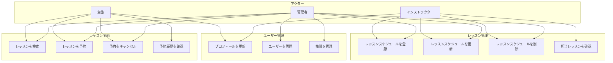

# スキースクール管理システム要件定義

## 1. システム概要

### 1.1 目的
- スキースクールの受講管理をWeb化し、複数人での同時管理を可能にする
- 受講者の予約管理と履歴管理を効率化する
- インストラクターのスケジュール管理を効率化する

### 1.2 対象ユーザー
1. 管理者（スクール本部スタッフ）
2. インストラクター
3. 受講者（スクール生）

## 2. 機能要件

### 2.1 ユーザー管理機能
#### 2.1.1 ユーザー登録・認証
- メールアドレスとパスワードによる認証
- ユーザーロール（管理者、インストラクター、受講者）の管理
- プロフィール情報の管理
  - 氏名
  - 電話番号
  - 緊急連絡先

### 2.2 レッスン管理機能
#### 2.2.1 レッスンレベル管理
- レッスンレベルの設定（初級、中級、上級など）
- レベルごとの説明文管理

#### 2.2.2 レッスンスケジュール管理
- レッスンの作成・編集・削除
- レッスン情報の管理
  - 開催日時
  - 所要時間
  - 定員
  - 担当インストラクター
  - レッスンレベル
  - 予約状況

### 2.3 予約管理機能
#### 2.3.1 予約操作
- オンラインでの予約受付
- 予約のキャンセル
- 予約状況の確認
- 定員管理

#### 2.3.2 予約通知
- 予約完了メール送信
- レッスン前日のリマインドメール送信
- キャンセル通知メール送信

### 2.4 インストラクター管理機能
#### 2.4.1 スケジュール管理
- 勤務可能時間の登録
- 担当レッスンの確認
- レッスンスケジュールの調整

### 2.5 受講履歴管理機能
- 受講履歴の記録
- 受講レベルの進捗管理
- 過去の受講レッスンの確認

### 2.6 管理機能
- ユーザー管理（追加・編集・削除）
- レッスン管理（追加・編集・削除）
- 予約状況の一覧表示
- 各種統計情報の表示

## 3. 非機能要件

### 3.1 性能要件
- 複数ユーザーによる同時アクセスへの対応
- レスポンス時間：1秒以内
- 24時間365日の稼働

### 3.2 セキュリティ要件
- ユーザー認証の実装
- パスワードの暗号化
- アクセス権限の管理
- 個人情報の適切な保護

### 3.3 運用要件
- バックアップの定期的な実施
- システムログの保管
- エラー発生時の通知機能

### 3.4 ユーザビリティ要件
- 直感的な操作性
- レスポンシブデザイン（PC、スマートフォン対応）
- 分かりやすいエラーメッセージの表示

## 4. 制約事項
- 地域密着型のスクールであることを考慮したシステム規模
- 既存のエクセルデータからの移行対応
- スキー場の営業期間に合わせた運用体制

## 5. 将来の拡張性
- 複数スキー場での展開可能性
- オンライン決済システムの導入
- レッスン動画のオンライン共有機能
- 顧客満足度調査機能の追加

## ユースケース図

### アクターの説明

1. 生徒
   - レッスンの検索・予約・キャンセル
   - 予約履歴の確認
   - 自身のプロフィール更新

2. インストラクター
   - レッスンスケジュールの登録・更新・削除
   - 担当レッスンの確認
   - 自身のプロフィール更新

3. 管理者
   - ユーザー管理（生徒・インストラクター）
   - 権限管理
   - すべてのレッスン管理
   - すべての予約管理

### ユースケースの詳細

#### レッスン予約
- レッスンを検索：日付、時間、インストラクター、スキルレベルで検索可能
- レッスンを予約：空き状況を確認して予約
- 予約をキャンセル：開始時間24時間前まで可能
- 予約履歴を確認：過去の予約履歴と今後の予約を確認

#### レッスン管理
- レッスンスケジュールを登録：日時、定員、スキルレベルを設定
- レッスンスケジュールを更新：内容の変更、状態の更新
- レッスンスケジュールを削除：予約がない場合のみ可能
- 担当レッスンを確認：自身が担当するレッスンの一覧を確認

#### ユーザー管理
- プロフィールを更新：個人情報、連絡先情報の更新
- ユーザーを管理：アカウントの作成、停止、削除
- 権限を管理：ユーザーの役割（生徒・インストラクター・管理者）の設定
