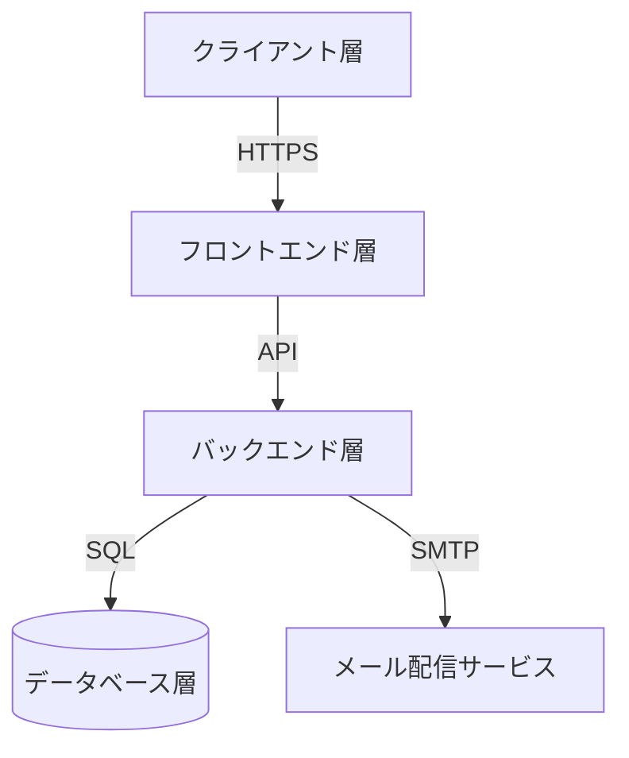
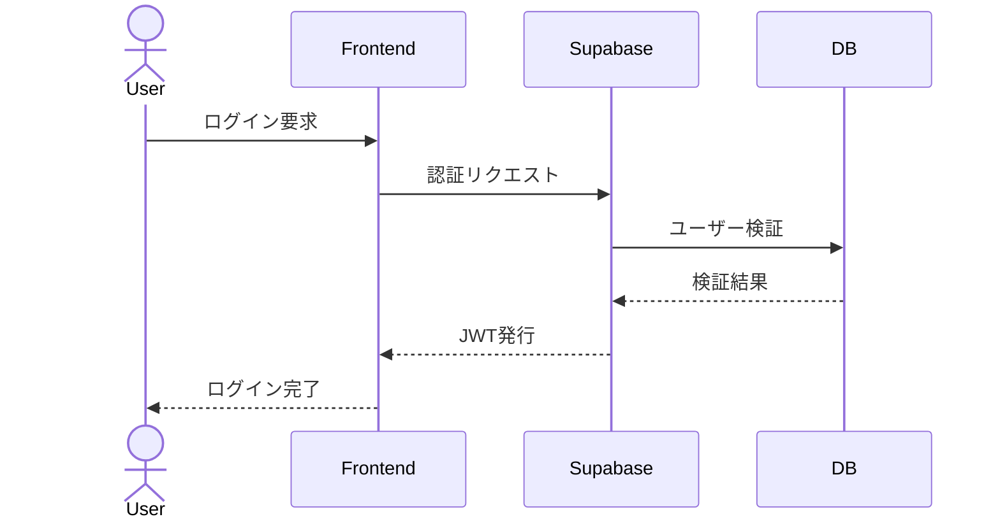
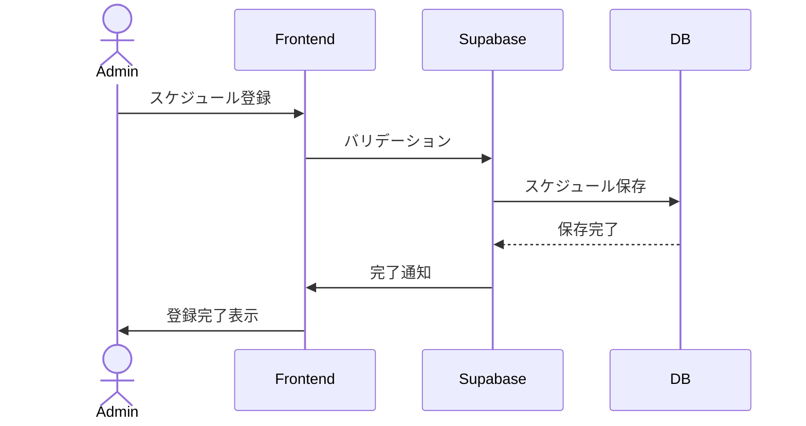
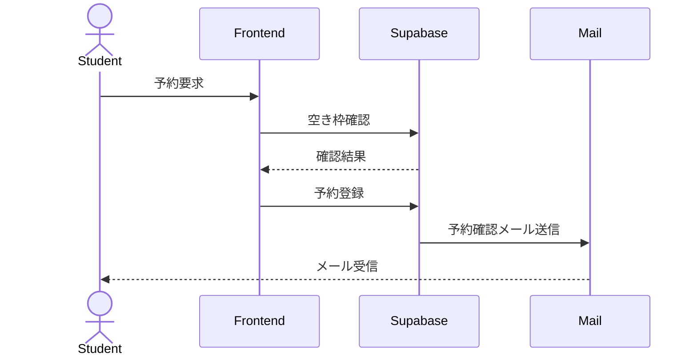
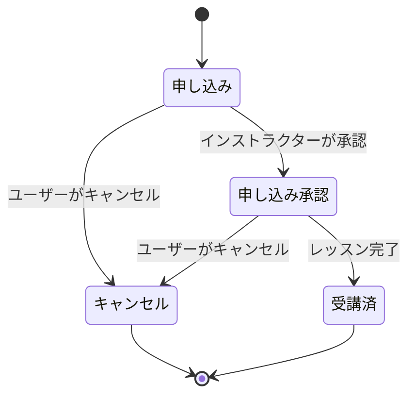
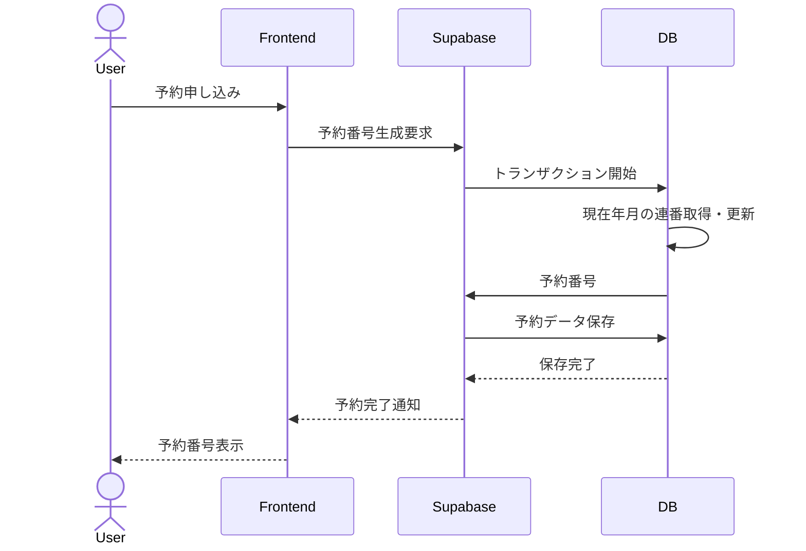
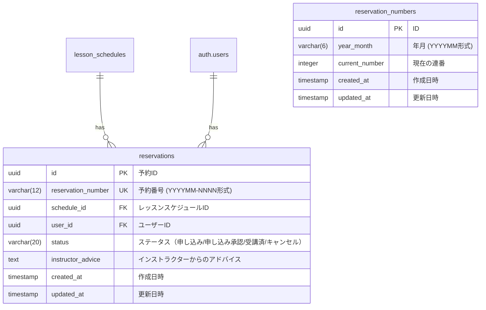
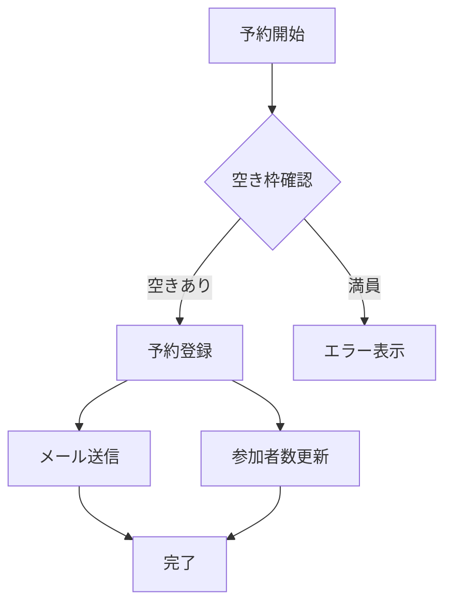
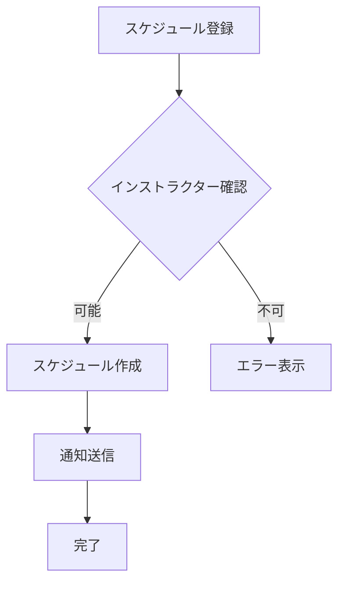

# スキースクール管理システム 詳細設計書

## 1. システムアーキテクチャ設計

### 1.1 全体構成


### 1.2 使用技術
- **フロントエンド**
  - Next.js 14 (App Router)
  - TypeScript
  - Refine Framework
  - Shadcn UI
  - TailwindCSS
  - React Query

- **バックエンド**
  - Supabase
    - PostgreSQL
    - Authentication
    - Storage
    - Edge Functions
  - Node.js (Edge Functions用)

- **インフラ**
  - Vercel (フロントエンド)
  - Supabase Cloud (バックエンド)

### 1.3 ディレクトリ構成
```
プロジェクトルート/
├── next-app/                  # フロントエンドアプリケーション
│   ├── src/
│   │   ├── app/                  # Next.js App Router
│   │   │   ├── components/           # 共通コンポーネント
│   │   │   │   ├── ui/              # Shadcn UIコンポーネント
│   │   │   │   └── features/        # 機能別コンポーネント
│   │   │   ├── hooks/               # カスタムフック
│   │   │   ├── lib/                 # ユーティリティ
│   │   │   ├── providers/           # プロバイダー
│   │   │   └── types/              # 型定義
│   │   └── styles/                # スタイル定義
│   │
├── supabase/                  # バックエンド
│   ├── migrations/              # DBマイグレーション
│   │   ├── YYYYMMDDHHMMSS_*.sql   # マイグレーションファイル
│   │   └── ...
│   ├── functions/              # Edge Functions
│   │   ├── email-notifications/  # メール通知関連
│   │   └── ...
│   └── seed.sql               # シードデータ
│
└── docs/                      # ドキュメント
    ├── 01-要件概要.md
    ├── 02-要件定義.md
    ├── 03-詳細設計.md
    └── 04-DB設計.md
```

## 2. 認証・認可設計

### 2.1 認証フロー


### 2.2 権限設計

| 機能 | 管理者 | インストラクター | 受講者 |
|------|--------|------------------|--------|
| レッスン管理 | ○ | △（閲覧のみ） | △（閲覧のみ） |
| 予約管理 | ○ | △（担当分） | △（自身の予約） |
| ユーザー管理 | ○ | × | × |
| スケジュール管理 | ○ | △（自身の予定） | × |

## 3. 機能詳細設計

### 3.1 レッスン管理機能
#### 3.1.1 レッスンスケジュール作成


#### 3.1.2 レッスン予約フロー


### 3.1 予約システム
#### 3.1.1 予約番号体系
- 形式：`YYYYMM-NNNN`
  - `YYYYMM`: 予約作成年月（例：202402）
  - `-`: 区切り文字
  - `NNNN`: 月間連番（0001から開始）
- 例：`202402-0001`
- 文字数：12文字（固定長）

#### 3.1.2 予約ステータス管理


| ステータス | 説明 | 遷移可能な次のステータス |
|------------|------|------------------------|
| 申し込み | レッスンの予約申し込みが行われた初期状態 | 申し込み承認, キャンセル |
| 申し込み承認 | インストラクターが予約を承認した状態 | 受講済, キャンセル |
| 受講済 | レッスンが完了した状態 | なし |
| キャンセル | 予約がキャンセルされた状態 | なし |

#### 3.1.3 予約番号生成フロー


#### 3.1.4 データベース設計


#### 3.1.5 エラーハンドリング
1. 予約番号生成エラー
   - 重複エラー：トランザクションをロールバックし再試行（最大3回）
   - 上限到達エラー：管理者に通知
   - デッドロック：一定時間待機後に再試行

2. 予約ステータス変更エラー
   - 不正な遷移：エラーメッセージを表示
   - 権限エラー：適切な権限がない旨を表示
   - システムエラー：管理者に通知

#### 3.1.6 監視項目
1. 予約関連
   - 月間予約数
   - キャンセル率
   - ステータス別予約数

2. システム性能
   - 予約番号生成の応答時間
   - 予約処理のエラー率
   - 同時予約処理数

## 4. データフロー設計

### 4.1 予約処理


### 4.2 レッスンスケジュール管理


## 5. エラーハンドリング設計

### 5.1 エラー種別
1. バリデーションエラー
2. 認証エラー
3. 権限エラー
4. システムエラー

### 5.2 エラー処理フロー
```typescript
interface ErrorResponse {
  code: string;
  message: string;
  details?: unknown;
}

enum ErrorCode {
  VALIDATION_ERROR = 'VALIDATION_ERROR',
  AUTH_ERROR = 'AUTH_ERROR',
  PERMISSION_ERROR = 'PERMISSION_ERROR',
  SYSTEM_ERROR = 'SYSTEM_ERROR'
}
```

## 6. 監視設計

### 6.1 監視項目
1. システムパフォーマンス
   - レスポンスタイム
   - エラー率
   - リソース使用率

2. ビジネスメトリクス
   - 予約数
   - キャンセル率
   - レッスン実施率

### 6.2 アラート設定
1. エラー率が5%を超えた場合
2. レスポンスタイムが2秒を超えた場合
3. ディスク使用率が80%を超えた場合

## 7. バックアップ・リストア設計

### 7.1 バックアップ方針
- 日次フルバックアップ
- トランザクションログの継続的バックアップ
- 30日間のバックアップ保持

### 7.2 リストア手順
1. 最新のフルバックアップを取得
2. トランザクションログを適用
3. データ整合性の確認 