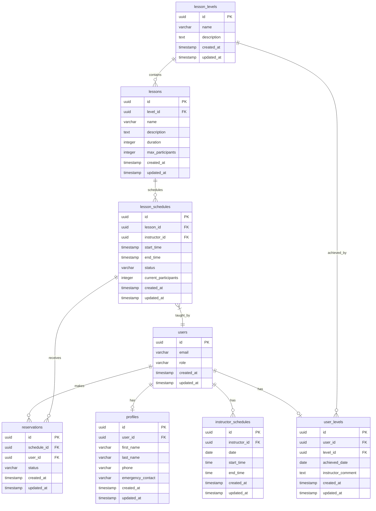

# スキースクール管理システム データベース設計書

## 1. ER図



## 2. テーブル定義

### 2.1 users
Supabaseの認証機能で使用される標準テーブル

| カラム名 | 型 | NULL | 主キー | 説明 |
|----------|-----|------|---------|------|
| id | uuid | NO | YES | ユーザーID |
| email | varchar(255) | NO | NO | メールアドレス |
| role | varchar(20) | NO | NO | ロール（admin/instructor/student） |
| created_at | timestamp | NO | NO | 作成日時 |
| updated_at | timestamp | NO | NO | 更新日時 |

### 2.2 profiles
| カラム名 | 型 | NULL | 主キー | 説明 |
|----------|-----|------|---------|------|
| id | uuid | NO | YES | プロファイルID |
| user_id | uuid | NO | NO | ユーザーID (FK) |
| first_name | varchar(50) | NO | NO | 名 |
| last_name | varchar(50) | NO | NO | 姓 |
| phone | varchar(20) | YES | NO | 電話番号 |
| emergency_contact | varchar(20) | YES | NO | 緊急連絡先 |
| created_at | timestamp | NO | NO | 作成日時 |
| updated_at | timestamp | NO | NO | 更新日時 |

### 2.3 lesson_levels
| カラム名 | 型 | NULL | 主キー | 説明 |
|----------|-----|------|---------|------|
| id | uuid | NO | YES | レベルID |
| name | varchar(50) | NO | NO | レベル名（初級、中級、上級など） |
| description | text | YES | NO | レベル説明 |
| created_at | timestamp | NO | NO | 作成日時 |
| updated_at | timestamp | NO | NO | 更新日時 |

### 2.4 lessons
| カラム名 | 型 | NULL | 主キー | 説明 |
|----------|-----|------|---------|------|
| id | uuid | NO | YES | レッスンID |
| level_id | uuid | NO | NO | レベルID (FK) |
| name | varchar(100) | NO | NO | レッスン名 |
| description | text | YES | NO | レッスン説明 |
| duration | integer | NO | NO | 所要時間（分） |
| max_participants | integer | NO | NO | 最大参加人数 |
| created_at | timestamp | NO | NO | 作成日時 |
| updated_at | timestamp | NO | NO | 更新日時 |

### 2.5 lesson_schedules
| カラム名 | 型 | NULL | 主キー | 説明 |
|----------|-----|------|---------|------|
| id | uuid | NO | YES | スケジュールID |
| lesson_id | uuid | NO | NO | レッスンID (FK) |
| instructor_id | uuid | NO | NO | インストラクターID (FK) |
| start_time | timestamp | NO | NO | 開始日時 |
| end_time | timestamp | NO | NO | 終了日時 |
| status | varchar(20) | NO | NO | 状態（open/closed/cancelled） |
| current_participants | integer | NO | NO | 現在の参加者数 |
| created_at | timestamp | NO | NO | 作成日時 |
| updated_at | timestamp | NO | NO | 更新日時 |

### 2.6 reservations
| カラム名 | 型 | NULL | 主キー | 説明 |
|----------|-----|------|---------|------|
| id | uuid | NO | YES | 予約ID |
| schedule_id | uuid | NO | NO | スケジュールID (FK) |
| user_id | uuid | NO | NO | ユーザーID (FK) |
| status | varchar(20) | NO | NO | 状態（confirmed/cancelled） |
| created_at | timestamp | NO | NO | 作成日時 |
| updated_at | timestamp | NO | NO | 更新日時 |

### 2.7 instructor_schedules
| カラム名 | 型 | NULL | 主キー | 説明 |
|----------|-----|------|---------|------|
| id | uuid | NO | YES | スケジュールID |
| instructor_id | uuid | NO | NO | インストラクターID (FK) |
| date | date | NO | NO | 勤務可能日 |
| start_time | time | NO | NO | 開始時間 |
| end_time | time | NO | NO | 終了時間 |
| created_at | timestamp | NO | NO | 作成日時 |
| updated_at | timestamp | NO | NO | 更新日時 |

### 2.8 user_levels
| カラム名 | 型 | NULL | 主キー | 説明 |
|----------|-----|------|---------|------|
| id | uuid | NO | YES | レベル達成ID |
| user_id | uuid | NO | NO | ユーザーID (FK) |
| level_id | uuid | NO | NO | レベルID (FK) |
| achieved_date | date | NO | NO | レベル達成日 |
| instructor_comment | text | YES | NO | インストラクターのコメント |
| created_at | timestamp | NO | NO | 作成日時 |
| updated_at | timestamp | NO | NO | 更新日時 |

## 3. インデックス設計

### 3.1 パフォーマンス最適化用インデックス
| テーブル名 | インデックス名 | カラム | 説明 |
|------------|----------------|--------|------|
| users | idx_users_email | email | メールアドレス検索用 |
| users | idx_users_role | role | ロールによる検索用 |
| lesson_schedules | idx_schedules_dates | start_time, end_time | 日付範囲検索用 |
| reservations | idx_reservations_user | user_id | ユーザーごとの予約検索用 |
| instructor_schedules | idx_instructor_dates | instructor_id, date | インストラクターの日付検索用 |
| user_levels | idx_user_levels | user_id, level_id | ユーザーのレベル検索用 |

### 3.2 外部キー制約
| テーブル名 | 制約名 | 参照先 |
|------------|--------|--------|
| profiles | fk_profiles_user | users(id) |
| lessons | fk_lessons_level | lesson_levels(id) |
| lesson_schedules | fk_schedules_lesson | lessons(id) |
| lesson_schedules | fk_schedules_instructor | users(id) |
| reservations | fk_reservations_schedule | lesson_schedules(id) |
| reservations | fk_reservations_user | users(id) |
| instructor_schedules | fk_instructor_schedules_user | users(id) |
| user_levels | fk_user_levels_user | users(id) |
| user_levels | fk_user_levels_level | lesson_levels(id) |

## 4. RLSポリシー設計

### 4.1 users
```sql
-- 読み取り: 全ユーザー
CREATE POLICY "Users can view their own data" ON users
  FOR SELECT USING (auth.uid() = id);

-- 更新: 管理者のみ
CREATE POLICY "Only admins can update users" ON users
  FOR UPDATE USING (auth.role() = 'admin');
```

### 4.2 lesson_schedules
```sql
-- 読み取り: 全ユーザー
CREATE POLICY "Anyone can view lesson schedules" ON lesson_schedules
  FOR SELECT USING (true);

-- 作成/更新: 管理者のみ
CREATE POLICY "Only admins can manage lesson schedules" ON lesson_schedules
  FOR ALL USING (auth.role() = 'admin');
```

### 4.3 reservations
```sql
-- 読み取り: 関連ユーザーのみ
CREATE POLICY "Users can view their own reservations" ON reservations
  FOR SELECT USING (auth.uid() = user_id);

-- 作成: 認証済みユーザー
CREATE POLICY "Authenticated users can create reservations" ON reservations
  FOR INSERT WITH CHECK (auth.role() IN ('student', 'admin'));
```

## 5. データ型の選定理由

### 5.1 UUID型の使用
- グローバルでユニークな識別子が必要
- 分散システムでの一意性保証
- セキュリティ上の利点（連番による推測防止）

### 5.2 TIMESTAMP型の使用
- タイムゾーン情報の保持
- 日時の正確な管理
- データの整合性確保

### 5.3 VARCHAR型の長さ制限
- email: 255文字（標準的なメールアドレスの最大長）
- name: 50文字（一般的な名前の長さ）
- phone: 20文字（国際電話番号対応） 