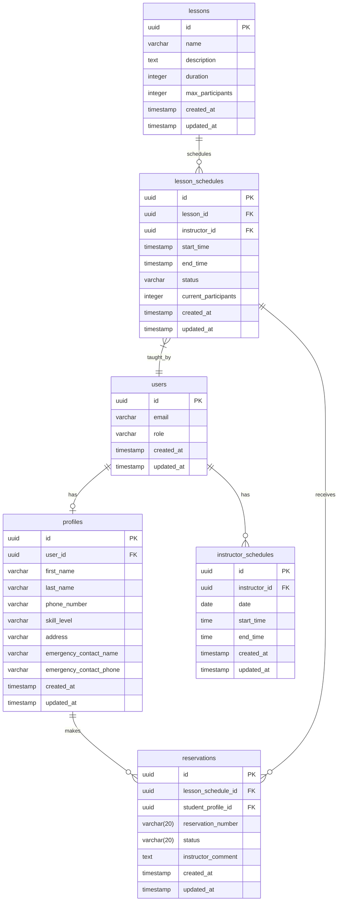

# スキースクール管理システム データベース設計書

## 1. ER図



## 2. テーブル定義

### 2.1 users
Supabaseの認証機能で使用される標準テーブル

| カラム名 | 型 | NULL | 主キー | 説明 |
|----------|-----|------|---------|------|
| id | uuid | NO | YES | ユーザーID |
| email | varchar(255) | NO | NO | メールアドレス |
| role | varchar(20) | NO | NO | ロール（admin/instructor/student） |
| created_at | timestamp | NO | NO | 作成日時 |
| updated_at | timestamp | NO | NO | 更新日時 |

### 2.2 profiles
| カラム名 | 型 | NULL | 主キー | 説明 |
|----------|-----|------|---------|------|
| id | uuid | NO | YES | プロファイルID |
| user_id | uuid | NO | NO | ユーザーID (FK) |
| first_name | varchar(50) | NO | NO | 名 |
| last_name | varchar(50) | NO | NO | 姓 |
| phone_number | varchar(20) | YES | NO | 電話番号 |
| skill_level | varchar(20) | YES | NO | スキルレベル |
| address | text | YES | NO | 住所 |
| emergency_contact_name | varchar(100) | YES | NO | 緊急連絡先名 |
| emergency_contact_phone | varchar(20) | YES | NO | 緊急連絡先電話番号 |
| created_at | timestamp | NO | NO | 作成日時 |
| updated_at | timestamp | NO | NO | 更新日時 |

### 2.3 lessons
| カラム名 | 型 | NULL | 主キー | 説明 |
|----------|-----|------|---------|------|
| id | uuid | NO | YES | レッスンID |
| name | varchar(100) | NO | NO | レッスン名 |
| description | text | YES | NO | レッスン説明 |
| duration | integer | NO | NO | 所要時間（分） |
| max_participants | integer | NO | NO | 最大参加人数 |
| created_at | timestamp | NO | NO | 作成日時 |
| updated_at | timestamp | NO | NO | 更新日時 |

### 2.4 lesson_schedules
| カラム名 | 型 | NULL | 主キー | 説明 |
|----------|-----|------|---------|------|
| id | uuid | NO | YES | スケジュールID |
| lesson_id | uuid | NO | NO | レッスンID (FK) |
| instructor_id | uuid | NO | NO | インストラクターID (FK) |
| start_time | timestamp | NO | NO | 開始日時 |
| end_time | timestamp | NO | NO | 終了日時 |
| status | varchar(20) | NO | NO | 状態（open/closed/cancelled） |
| current_participants | integer | NO | NO | 現在の参加者数 |
| created_at | timestamp | NO | NO | 作成日時 |
| updated_at | timestamp | NO | NO | 更新日時 |

### 2.5 reservations
| カラム名 | 型 | NULL | 主キー | 説明 |
|----------|-----|------|---------|------|
| id | uuid | NO | YES | 予約ID |
| lesson_schedule_id | uuid | NO | NO | スケジュールID (FK) |
| student_profile_id | uuid | NO | NO | 生徒プロファイルID (FK) |
| reservation_number | varchar(20) | NO | NO | 予約番号（YYYYMM-NNNN形式） |
| status | varchar(20) | NO | NO | 状態（申し込み/申し込み承認/受講済/キャンセル） |
| instructor_comment | text | YES | NO | インストラクターからのアドバイス |
| created_at | timestamp | NO | NO | 作成日時 |
| updated_at | timestamp | NO | NO | 更新日時 |

### 2.6 instructor_schedules
| カラム名 | 型 | NULL | 主キー | 説明 |
|----------|-----|------|---------|------|
| id | uuid | NO | YES | スケジュールID |
| instructor_id | uuid | NO | NO | インストラクターID (FK) |
| date | date | NO | NO | 勤務可能日 |
| start_time | time | NO | NO | 開始時間 |
| end_time | time | NO | NO | 終了時間 |
| created_at | timestamp | NO | NO | 作成日時 |
| updated_at | timestamp | NO | NO | 更新日時 |

## 3. インデックス設計

### 3.1 パフォーマンス最適化用インデックス
| テーブル名 | インデックス名 | カラム | 説明 |
|------------|----------------|--------|------|
| users | idx_users_email | email | メールアドレス検索用 |
| users | idx_users_role | role | ロールによる検索用 |
| lesson_schedules | idx_schedules_dates | start_time, end_time | 日付範囲検索用 |
| reservations | idx_reservations_student | student_profile_id | 生徒ごとの予約検索用 |
| reservations | idx_reservations_number | reservation_number | 予約番号検索用 |
| instructor_schedules | idx_instructor_dates | instructor_id, date | インストラクターの日付検索用 |

### 3.2 外部キー制約
| テーブル名 | 制約名 | 参照先 |
|------------|--------|--------|
| profiles | fk_profiles_user | users(id) |
| lesson_schedules | fk_schedules_lesson | lessons(id) |
| lesson_schedules | fk_schedules_instructor | users(id) |
| reservations | fk_reservations_schedule | lesson_schedules(id) |
| reservations | fk_reservations_student_profile | profiles(id) |
| instructor_schedules | fk_instructor_schedules_user | users(id) |

## 4. RLSポリシー設計

各テーブルに対するユーザーロールごとのアクセス権限を以下に定義します。
空欄は「アクセス不可」を示します。

### 4.1 users テーブル

| ユーザーロール | Create | Read | Update | Delete |
|------------|--------|------|---------|---------|
| 認証前ユーザー | - | - | - | - |
| 管理者 | すべての行を作成可能 | すべての行を閲覧可能 | すべての行を更新可能 | すべての行を削除可能 |
| インストラクター | - | - | - | - |
| 受講者 | - | - | - | - |

### 4.2 profiles テーブル

| ユーザーロール | Create | Read | Update | Delete |
|------------|--------|------|---------|---------|
| 認証前ユーザー | - | - | - | - |
| 管理者 | すべての行を作成可能 | すべての行を閲覧可能 | すべての行を更新可能 | すべての行を削除可能 |
| インストラクター | - | すべての行を閲覧可能 | 自分のプロファイルのみ更新可能 | - |
| 受講者 | - | 自分のプロファイルのみ閲覧可能 | 自分のプロファイルのみ更新可能 | - |

### 4.3 lessons テーブル

| ユーザーロール | Create | Read | Update | Delete |
|------------|--------|------|---------|---------|
| 認証前ユーザー | - | すべての行を閲覧可能 | - | - |
| 管理者 | すべての行を作成可能 | すべての行を閲覧可能 | すべての行を更新可能 | すべての行を削除可能 |
| インストラクター | - | すべての行を閲覧可能 | - | - |
| 受講者 | - | すべての行を閲覧可能 | - | - |

### 4.4 lesson_schedules テーブル

| ユーザーロール | Create | Read | Update | Delete |
|------------|--------|------|---------|---------|
| 認証前ユーザー | - | すべての行を閲覧可能 | - | - |
| 管理者 | すべての行を作成可能 | すべての行を閲覧可能 | すべての行を更新可能 | すべての行を削除可能 |
| インストラクター | - | すべての行を閲覧可能 | 自分が担当するレッスンのみ更新可能 | - |
| 受講者 | - | すべての行を閲覧可能 | - | - |

### 4.5 reservations テーブル

| ユーザーロール | Create | Read | Update | Delete |
|------------|--------|------|---------|---------|
| 認証前ユーザー | - | - | - | - |
| 管理者 | すべての行を作成可能 | すべての行を閲覧可能 | すべての行を更新可能 | すべての行を削除可能 |
| インストラクター | - | 自分が担当するレッスンの予約のみ閲覧可能 | 自分が担当するレッスンの予約のみ更新可能 | - |
| 受講者 | 自分の予約のみ作成可能 | 自分の予約のみ閲覧可能 | 自分の予約のみ更新可能 | 自分の予約のみ削除可能 |

### 4.6 instructor_schedules テーブル

| ユーザーロール | Create | Read | Update | Delete |
|------------|--------|------|---------|---------|
| 認証前ユーザー | - | - | - | - |
| 管理者 | すべての行を作成可能 | すべての行を閲覧可能 | すべての行を更新可能 | すべての行を削除可能 |
| インストラクター | - | 自分のスケジュールのみ閲覧可能 | 自分のスケジュールのみ更新可能 | - |
| 受講者 | - | すべての行を閲覧可能 | - | - |

### 4.7 アクセス制限の実装方法

各テーブルのアクセス制限は、以下のSQL条件で実装します：

1. profiles
```sql
-- インストラクター・受講者の自身のプロファイルへのアクセス
user_id = auth.uid()
-- 管理者のアクセス
is_admin()
```

2. lesson_schedules
```sql
-- インストラクターの担当レッスンへのアクセス
instructor_id = auth.uid()
```

3. reservations
```sql
-- 受講者の自身の予約へのアクセス
student_profile_id IN (SELECT id FROM profiles WHERE user_id = auth.uid())
-- インストラクターの担当レッスンの予約へのアクセス
lesson_schedule_id IN (SELECT id FROM lesson_schedules WHERE instructor_id = auth.uid())
```

4. instructor_schedules
```sql
-- インストラクターの自身のスケジュールへのアクセス
instructor_id = auth.uid()
```

## 5. データ型の選定理由

### 5.1 UUID型の使用
- グローバルでユニークな識別子が必要
- 分散システムでの一意性保証
- セキュリティ上の利点（連番による推測防止）

### 5.2 TIMESTAMP型の使用
- タイムゾーン情報の保持（JST）
- 日時の正確な管理
- データの整合性確保

### 5.3 VARCHAR型の長さ制限
- email: 255文字（標準的なメールアドレスの最大長）
- name: 50文字（一般的な名前の長さ）
- phone_number: 20文字（国際電話番号対応）
- emergency_contact_name: 100文字（フルネームと関係性を含む）
- emergency_contact_phone: 20文字（国際電話番号対応） 