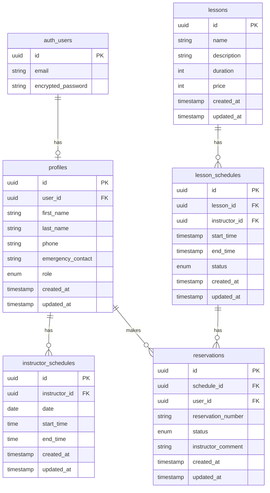

# データベース定義

## ER図

## テーブル定義

### profiles

| カラム名 | 型 | NULL | 説明 |
|----------|-----|------|------|
| id | UUID | NO | プロフィールID |
| user_id | UUID | NO | ユーザーID（auth.usersテーブルの外部キー） |
| first_name | VARCHAR(50) | NO | 名 |
| last_name | VARCHAR(50) | NO | 姓 |
| phone | VARCHAR(20) | YES | 電話番号 |
| emergency_contact | VARCHAR(20) | YES | 緊急連絡先 |
| role | profile_role | NO | ユーザーの役割（管理者、インストラクター、生徒） |
| created_at | TIMESTAMP WITH TIME ZONE | NO | 作成日時 |
| updated_at | TIMESTAMP WITH TIME ZONE | NO | 更新日時 |

### profile_role（ENUM型）

| 値 | 説明 |
|-----|------|
| admin | 管理者 |
| instructor | インストラクター |
| student | 生徒 |

### lessons

| カラム名 | 型 | NULL | 説明 |
|----------|-----|------|------|
| id | UUID | NO | レッスンID |
| name | VARCHAR(100) | NO | レッスン名 |
| description | TEXT | NO | レッスンの説明 |
| duration | INTEGER | NO | レッスン時間（分） |
| price | INTEGER | NO | レッスン料金 |
| created_at | TIMESTAMP WITH TIME ZONE | NO | 作成日時 |
| updated_at | TIMESTAMP WITH TIME ZONE | NO | 更新日時 |

### lesson_schedules

| カラム名 | 型 | NULL | 説明 |
|----------|-----|------|------|
| id | UUID | NO | レッスンスケジュールID |
| lesson_id | UUID | NO | レッスンID（lessonsテーブルの外部キー） |
| instructor_id | UUID | NO | インストラクターID（profilesテーブルの外部キー） |
| start_time | TIMESTAMP WITH TIME ZONE | NO | 開始日時 |
| end_time | TIMESTAMP WITH TIME ZONE | NO | 終了日時 |
| status | VARCHAR(20) | NO | ステータス（open, closed） |
| created_at | TIMESTAMP WITH TIME ZONE | NO | 作成日時 |
| updated_at | TIMESTAMP WITH TIME ZONE | NO | 更新日時 |

### instructor_schedules

| カラム名 | 型 | NULL | 説明 |
|----------|-----|------|------|
| id | UUID | NO | インストラクタースケジュールID |
| instructor_id | UUID | NO | インストラクターID（profilesテーブルの外部キー） |
| date | DATE | NO | 勤務日 |
| start_time | TIME | NO | 勤務開始時間 |
| end_time | TIME | NO | 勤務終了時間 |
| created_at | TIMESTAMP WITH TIME ZONE | NO | 作成日時 |
| updated_at | TIMESTAMP WITH TIME ZONE | NO | 更新日時 |

### reservations

| カラム名 | 型 | NULL | 説明 |
|----------|-----|------|------|
| id | UUID | NO | 予約ID |
| schedule_id | UUID | NO | レッスンスケジュールID（lesson_schedulesテーブルの外部キー） |
| user_id | UUID | NO | ユーザーID（profilesテーブルの外部キー） |
| reservation_number | VARCHAR(20) | NO | 予約番号 |
| status | VARCHAR(20) | NO | ステータス（申し込み、申し込み承認、受講済、キャンセル） |
| instructor_comment | TEXT | YES | インストラクターのコメント |
| created_at | TIMESTAMP WITH TIME ZONE | NO | 作成日時 |
| updated_at | TIMESTAMP WITH TIME ZONE | NO | 更新日時 | 